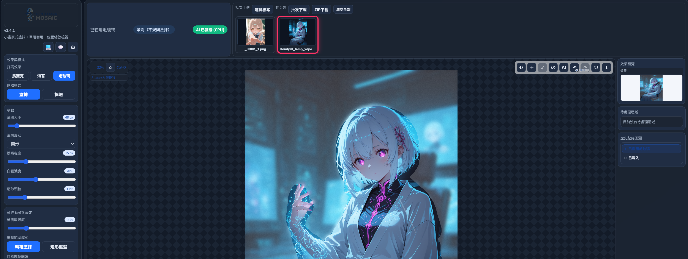

# 紳士打碼 Next (Gentleman-Mosaic-Next) v2.4.1

> ### 🚀 [點此立即前往下載 v2.4.1 懶人發布包 (226 MB)](https://github.com/Chaos2-lgtm/Gentleman-Mosaic-Next/releases/tag/v2.4.1)
> **完全 0 相依・免安裝 Python・解壓縮雙擊 start_app.bat 直接用！**

- **當前維護者**: [Chaos2-lgtm](https://github.com/Chaos2-lgtm/Gentleman-Mosaic-Next) (Next 版)
- **直接源自專案**: [yuuhouse/Gentleman-Mosaic-forge](https://github.com/yuuhouse/Gentleman-Mosaic-forge) (Forge 再版)
- **初始原創專案**: [leeprinxin/Gentleman-Mosaic](https://github.com/leeprinxin/Gentleman-Mosaic) (最初原版)
- **授權條款 (License)**: MIT

## 專案沿革與致謝
本專案為開源社群傳承與現代化重構版本，特別感謝歷任開發者的心血結晶：
1. **最初原創**：[leeprinxin/Gentleman-Mosaic](https://github.com/leeprinxin/Gentleman-Mosaic) —— 奠定「小畫家式塗抹＋單層套用」的核心體驗與直覺設計。
2. **二次開發 (Forge 版)**：[yuuhouse/Gentleman-Mosaic-forge](https://github.com/yuuhouse/Gentleman-Mosaic-forge) —— 本專案由此版本 Fork 而來，優化了 UI 比例與即時筆刷效能。
3. **Next 版 (本專案)**：[Chaos2-lgtm/Gentleman-Mosaic-Next](https://github.com/Chaos2-lgtm/Gentleman-Mosaic-Next) —— 於 v2.4.0 進行全面現代化架構升級，加入本機獨立 AI (YOLO-seg) 實例分割精確塗抹、0 相依獨立免安裝發布包、深淺主題切換。

> **AI 技術與模型致謝**：本專案本機 AI 視覺功能由 [Ultralytics](https://github.com/ultralytics/ultralytics) 的 YOLO 架構提供底層技術基礎；檢測模型 `sensitive_detect_v06.pt` 源自 Hugging Face 創作者 [sugarknight/sensitive-detect](https://huggingface.co/sugarknight/sensitive-detect) 的開源成果，特此致謝開源 AI 社群的無私奉獻與分享。

## 開發 / Vibe Coding 工具
- **Google Antigravity**：接手後（v2.4.0+）全端架構重構、本地獨立 AI (YOLO-seg) 模型整合、外觀主題系統與 0 相依獨立懶人發布包打包。
- **Git**：用於比對版本差異、追蹤版本變更與版本發布。
- **Chrome Headless**：用於執行 Canvas 操作體驗 benchmark，換算 FPS 與效能差異。


## 介面預覽



### v2.4.1 (Batch AI & UX Enhancement)
- **⚡ 批次 AI 打碼框選**：支援一鍵對上傳的批次（最多 30 張）圖片自動執行敏感部位 AI 偵測，可搭配「偵測後自動打碼」或手動逐張檢視微調。
- **全圖自適應視圖與切換置中**：點選與切換批次圖片時自動根據視窗比例縮放並置中，不再預設 100% 溢出；若手動放大檢視則智慧保留個別圖片視角。
- **海苔色票高對比選取框**：海苔顏色選取外框與圖片縮圖選取框同步改為高辨識度亮粉色霓虹光暈，深色模式下選取純黑等深色色票一目了然。

### v2.4.0 (AI Next)
- **本地獨立 AI 自動偵測敏感部位**：整合 Ultralytics YOLOv8/v11 引擎與 `sensitive_detect_v06.pt` 高精度模型，純 CPU 亦可極速推論（1080p 全高清照片僅約 0.39 秒）。
- **精確塗抹 vs 矩形框選**：支援實例分割多邊形（YOLO-seg），AI 偵測直接貼合器官真實邊緣精確塗抹（預設），並可隨時手動以畫布筆刷（加選 / 減選）微調。
- **自訂部位篩選**：支援 4 大敏感目標部位勾選（女性私密處、男性私密處、胸部／乳頭、臀部／肛門）。
- **敏感度動態拉條**：提供 0.01 ～ 1.00 敏感度閾值即時調節（預設 0.25），數值即時連動反饋。
- **外觀主題三合一**：支援白色模式、深色模式以及隨系統自動切換（預設隨系統），並新增左上角一鍵快速輪播切換鈕。
- **完整雙語系支援**：介面各控制項、AI 面板、狀態提示及模型名稱全面支援繁體中文與 English 即時切換。
- **專屬目錄動態掃描**：後端嚴格僅掃描專案目錄 `models/`，放入模型即時生效，絕不影響外部環境。
- **0 相依極致精簡懶人發布包**：單鍵啟動，免安裝 Python，體積從原本數 GB 徹底瘦身至壓縮包僅約 232 MB（解壓後不到 1 GB），純 CPU 亦能順暢運行。

### v2.3.2 
- 本次更新基於最新提交 `02ac597`：Overlay canvas for cursor & live-stroke
- 新增 overlay canvas，用於游標與即時塗抹筆跡顯示
- 改善因為2.3.1調整導致的效能下降
  
### v2.3.1 
- 壓縮整體 UI 尺寸，減少側欄、工具列、縮圖列與預覽欄佔用空間
- 放寬圖片自動適合視窗縮放下限，瀏覽器 100% 縮放下也更容易完整檢視大圖

### v2.3.0 
- 修復筆刷超出畫布時會停止塗抹的問題
- 調整 UI 比例，讓瀏覽器內可以完整顯示 4K 圖片
- 新增批次下載已完成打碼圖片功能
- 整理資料夾結構，提升可讀性與後續維護性
- 新增 `config/` 與 `assets/`，將 `launch.ini`、`runtime-config.js` 與示意圖片分門別類存放
- 將 archive 目錄進一步細分為 `archive/legacy` 和 `archive/docs`

### v2.2.0 4K 大圖效能升級
- 針對 4K / 高解析圖片操作重新優化：框選、塗抹、滑鼠 hover 不再反覆重算整張圖片。
- 效果預覽加入快取機制，只有選區、效果參數或圖片內容改變時才更新，大幅降低拖曳時的卡頓感。
- Canvas 重繪改用 `requestAnimationFrame` 節流，操作節奏更貼近螢幕刷新率，筆刷移動更順。
- 大圖歷史紀錄會自動控制快照數量，避免 4K 圖片連續 Undo/Redo 時吃爆記憶體。
- 仍保留完整解析度輸出：互動變順，不犧牲下載成品品質。

### 最新版v2.3.0 vs v2.1.0 操作體驗 FPS 比較

測試方式：使用本機 Chrome Headless 量測 `standalone.html` 核心 Canvas 流程，模擬圖片中 60% 區域套用馬賽克；操作體驗 FPS 以「預覽內容未變更時反覆 render」換算，並以常見螢幕刷新率 60fps 作為上限。測試檔位於 `tools/perf-compare-v210-v230.html`。

| 情境 | v2.1.0 | 最新版 | 操作體驗差異 |
|---|---:|---:|---:|
| 1080p 預覽未變更時操作 | 60fps | 60fps | 約 0% |
| 4K 預覽未變更時操作 | 約 14.3fps | 60fps | 約 +319% |

補充：真正按下「確定套用」時，兩版馬賽克演算法耗時接近；最新版主要提升的是拖曳、hover、選取後預覽未變更時的互動流暢度，尤其是 4K 圖片。

### v2.1.0 
- 設定面板改為右上角 icon（齒輪）
- 新增關於我 icon，並改為彈跳視窗（可按 `X`、遮罩、`Esc` 關閉）
- 語言與 Dark/Light 設定可寫入 `launch.ini` 並於下次啟動自動套用
- 新增選取方向切換：正向 / 反向
- 新增選取操作切換：加選 / 減選
- 新增快捷鍵：`Ctrl+Z` / `Ctrl+Shift+Z` / `Ctrl+Y` / `Ctrl+X`、`Space+左鍵拖移`
- 歷史回溯修正：Undo/Redo 可正確回復當次提示區域（待處理區域）
- 馬賽克演算法修正，顆粒效果對齊 [PEKO-STEP](https://www.peko-step.com/tool/imageeditor/index.php?lang=zhtw&type=19) 風格
- 圖片檢視優化：支援拖移平移檢視
- 深色模式配色優化，特別是中間圖片區塊網底更柔和

### v2.0.0 
- 批次上傳與圖片切換（最多 30 張）
- 每張圖片各自保存：待處理區域、歷史回溯（Undo/Redo）
- 縮圖右鍵選單：刪除圖片、下載該圖處理後結果
- 縮圖快捷選取：左鍵選擇、`Ctrl + 左鍵` 多選、`Shift + 左鍵` 區間選取、`Ctrl + A` 全選
- 支援 NSFW 自動偵測（NudeNet）：可調偵測閾值、模型 `320n` / `640m`
- 打碼方式：馬賽克、海苔（顏色、透明度、寬度、間隔、方向可調）
- 選取模式：框選、塗抹（圓形/方形筆刷）
- 支援深色模式與中英文介面切換

## 🚀 線上體驗與安裝啟動方式

> [!TIP]
> ### 🌐 想要免下載、立刻試玩看看？
> 如果您暫時不方便下載，可前往 **[🤗 Hugging Face Space 線上 Demo 試玩](https://huggingface.co/spaces/Flow26/Gentleman-Mosaic-Next)** 體驗 AI 敏感辨識核心能力！  
> *(🛡️ 隱私承諾：線上版圖片僅於伺服器記憶體中暫態運算，運算完即釋放，不留存任何照片)*
>
> ⚠️ **試玩前須知・純 AI 的局限與本專案的靈魂所在**：  
> 單純依靠 AI 辨識難免遇到特殊角度**漏抓**或**誤判**。線上 Demo 僅提供「純 AI 基礎辨識」，**未配備畫布編輯系統**，一旦 AI 漏判將無法手動挽救。  
> 
> 若您追求實用、滴水不漏且高效率的打碼體驗，**強烈推薦下載本機旗艦版（免安裝懶人包）**，享受本專案的靈魂核心功能：
> 1. 🎨 **前端互動畫布**：AI 框選後可隨時筆刷塗抹、加選／減選補正，秒修漏抓與擦除誤判！
> 2. ⚡ **批次 30 張極速處理**：多圖連續自動偵測打碼、即時進度條、縮圖無縫切換。
> 3. 🎛️ **打碼樣式自定義**：提供馬賽克尺寸自定義、海苔條紋自定義（顏色/寬度/間距/角度）、毛玻璃自定義。
> 4. 🔒 **100% 離線隱私保障**：226 MB 免安裝懶人包，解壓點擊即開，照片完全不出本機！
>
> 👉 **[點此前往 Releases 下載 v2.4.1 免安裝懶人包 (226 MB)](https://github.com/Chaos2-lgtm/Gentleman-Mosaic-Next/releases/tag/v2.4.1)**

### 📊 功能與體驗對照表

| 功能與體驗 | 🌐 線上試玩 Demo (HF Space) | 💻 本機旗艦版 (v2.4.1 懶人包) 🌟 推薦 |
| :--- | :---: | :---: |
| **使用門檻** | 免下載、瀏覽器即開即用（手機/Mac 亦可） | 免裝 Python、226 MB 懶人包下載、解壓雙擊秒開 |
| **運算與隱私** | 雲端 ZeroGPU（純記憶體處理、不存檔） | **本機 100% 離線運算、零資安洩漏風險** |
| **處理張數** | 僅支援單張圖片上傳 | **支援最多 30 張批次處理 + 即時進度** |
| **AI 漏抓 / 誤判修正** | ❌ 無法修正（無畫布） | ✅ **核心靈魂！** 框選 / 塗抹 / 加選 / 減選 |
| **打碼樣式自定義** | 基礎樣式選擇 | **馬賽克尺寸自定義、海苔條紋自定義、毛玻璃自定義** |
| **歷史回溯** | ❌ 無法復原 | ✅ 完整支援 `Undo` / `Redo` 與快捷鍵 |

---

本專案提供兩種使用方式：**免安裝懶人包（推薦）** 與 **自行建置環境（開發者）**。

### 方式 A：免安裝懶人包（推薦一般使用者）
最省心、最快速的體驗方式，完全零相依：
1. 前往 [Releases 頁面](https://github.com/Chaos2-lgtm/Gentleman-Mosaic-Next/releases) 下載最新版的 `Gentleman-Mosaic-Next-v2.4.1-portable.7z`。
2. 使用 7-Zip 解壓縮至任一英文目錄。
3. 雙擊執行目錄內的 **`start_app.bat`** 即可，免裝 Python、免裝微軟 C++ 運行庫，開箱即用！

---

### 方式 B：自行建置環境（開發者 / 手動安裝指南）
適合欲進行二次開發、客製化模型，或在非 Windows 平台（macOS / Linux）運行的開發者：

#### 1. 克隆儲存庫
```bash
git clone https://github.com/Chaos2-lgtm/Gentleman-Mosaic-Next.git
cd Gentleman-Mosaic-Next
```

#### 2. 建立並啟用 Python 虛擬環境（建議 Python 3.10 ~ 3.12）
```bash
# Windows
python -m venv .venv
.venv\Scripts\activate

# macOS / Linux
python3 -m venv .venv
source .venv/bin/activate
```

#### 3. 安裝後端依賴
```bash
# 推薦：先升級 pip 確保相容性
python -m pip install --upgrade pip

# 推薦：先安裝輕量純 CPU 版 PyTorch（僅約 180 MB，避免下載數 GB 顯卡冗餘套件）
pip install torch torchvision --extra-index-url https://download.pytorch.org/whl/cpu

# 安裝核心套件
pip install -r backend/requirements.txt
```

#### 4. 模型取得（自動或手動）
- **自動下載**：後端首次啟動時，若 `models/` 為空，將自動自 Hugging Face 下載預設模型 `sensitive_detect_v06.pt`。
- **手動下載**：亦可前往 [sugarknight/sensitive-detect](https://huggingface.co/sugarknight/sensitive-detect) 下載 `sensitive_detect_v06.pt` 並放置於專案根目錄的 `models/` 資料夾下。

#### 5. 啟動服務
- **一鍵腳本啟動（推薦）**：
  - **Windows**：直接雙擊 `start_app.bat`。
  - **macOS / Linux**：執行 `bash start_app.sh`（會自動檢測環境、喚醒後端並呼叫瀏覽器）。
- **手動指令啟動**（直接指名虛擬環境路徑，免除每次手動 activate 的繁瑣）：
  ```bash
  # Windows
  .venv\Scripts\python -m uvicorn backend.main:app --host 127.0.0.1 --port 7400

  # macOS / Linux
  .venv/bin/python -m uvicorn backend.main:app --host 127.0.0.1 --port 7400
  ```
  啟動後以瀏覽器開啟專案中的 `standalone.html` 即可開始使用！

---

### `config/launch.ini` 設定說明
```ini
[backend]
enabled=1
use_venv=1
venv_dir=.venv
create_venv=1
python_cmd=python
host=127.0.0.1
port=7400
reload=0
auto_install_deps=1
```

說明：
- `port` 會同步寫入 `config/runtime-config.js`，前端會使用該埠連線後端。
- 想關閉後端可設 `enabled=0`（僅做手動打碼編輯）。

## 開發模式（Standalone/Vite）
```bash
npm install
npm run dev
```

開啟：
```text
http://localhost:5173/standalone.html
```

注意：目前正式功能集中在 `standalone.html`。`src/App.jsx` 是早期/簡化 React 版本，沒有批次、NSFW 偵測、海苔、語言與主題設定等完整功能。

## 使用流程
1. 批次上傳圖片或拖曳圖片到畫布區。
2. 在上方縮圖列選擇要編輯的圖片。
3. 選擇打碼效果（馬賽克 / 海苔）。
4. 用框選或塗抹建立待處理區域。
5. 按「確定套用」完成本次打碼。
6. 需要時可用 Undo / Redo 回溯。
7. 右鍵縮圖可刪除或下載處理後圖片。

## 注意事項
- 第一次啟動會下載 Python 套件，時間較久屬正常。
- 若 Python 指令不是 `python`，可在 `launch.ini` 調整 `python_cmd`。
- 批次上限為 30 張，超過會提示並忽略多餘檔案。
